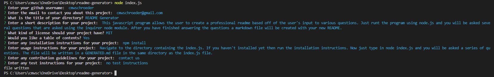
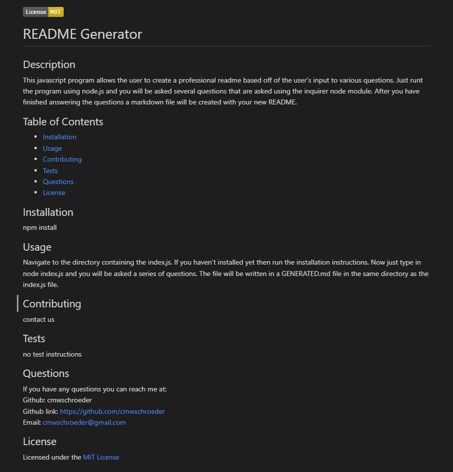

# README Generator

## Description

This javascript program allows the user to create a professional readme based off of the user's input to various questions. Just runt the program using node.js and you will be asked several questions that are asked using the inquirer node module. After you have finished answering the questions a markdown file will be created with your new README.

## Table of Contents

* [Technologies](#technologies)
* [Installation](#installation)
* [Usage](#usage)
* [License](#license)
* [Questions](#questions)

## Technologies

| Technology | Link |
| -------- | ------|
| Javascript |    |
| Node.js | https://nodejs.org/en/ |
| npm | https://www.npmjs.com/ |
| Inquirer | https://www.npmjs.com/package/inquirer |  

## Installation

npm install

## Usage

Navigate to the directory containing the index.js. If you haven't installed yet then run the installation instructions. Now just type in node index.js and you will be asked a series of questions. The file will be written in a GENERATED.md file in the same directory as the index.js file.

Here is an example set of answers that could be given to the program:  

This set of responses will give this readme:  

Link to video showing installation and usage: https://www.youtube.com/watch?v=8RtukaIXNn0

## Questions
If you have any questions you can reach me at:  
Github: cmwschroeder  
Github link: https://github.com/cmwschroeder  
Email: cmwschroeder@gmail.com

## License

Licensed under the [MIT License](LICENSE)